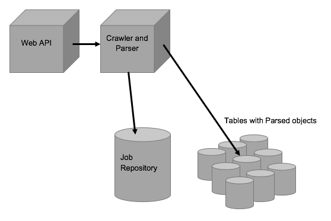

# jumpspider
A Data crawling exercise with NodeJS, MySQL, Mocha and Chai


<b>Jumpspider</b> is an exercise for crawling HTML documents and parsing data. It's designed as a starting point to add more parsing functionality and to scale up. This is an instance to research on data crawler topics and to test technology and software development practices.

 The implementation stack includes Node.js and MySQL. It also uses Mocha and Chai test libraries to facilitate a Behaviour-Driven Development and Continuous Integration approach.

In this example, the parsing is specifically tailored to get HTML tables with NBA division results that comply with a specific structure. This should be extended and generalized in the future to parse different types of data.

Jumpspider has been developed with a bigger distributed architecture in mind. Some of the implementation details may look like an overkill but were developed with the idea of scaling the solution in the future. 

- The solution can be accessed via a Web API as a service.
- Processes can work completely asynchronously.
- Each step of a crawl job is prepared to run asynchronously 
- Results are stored in the database (Jobs, HTML , Parsing results) for future coordination with different agents
- A basic BDD Integration Test is provided with Mocha and Chai as baseline to support CI


## Architecture
 


The system architecture is composed of a Node.js server that exposes a Web API and also contains a set of Crawl and Parse Methods and the routines for handling the database. 

An SQL server contains two databases: one for the Development environment and another one for the Test environment. Each database contain a table called 'repository' for storing the Job information, excecution time and the HTML document that was fetched when the job was started. Then the parser methods parse the data and create an unique table for the job that is meant to visualize the extracted HTML data in a tabular way in a table. The table is identified by the job id assigned to the task, for instance the job with an unique id 'b41075920de64561a68201c1280a184e' will create a table named 'tableb41075920de64561a68201c1280a184e'.

The following table details some of the main components and thier role:<br>

<table>
  <tr>
   <th>Component</th>
   <th>Item</th>
   <th>Type</th>
   <th>Description</th>
  </tr>
  
  <tr>
   <td><b>Node.js</b></td>
   <td>Web API</td>
   <td>Web Methods</td>
  <td>See the API section for details</td>
  </tr>
  
  <tr>
   <td></td>
   <td>Crawl & Parsings</td>
   <td>method</td>
  <td>Core system methods including:<br>
   - processJob()<br>
   - fetchUrl()<br>
   - parseTable()
  </td>
  </tr>
  
  <tr>
   <td></td>
   <td>Database handling</td>
   <td>method</td>
  <td>Database handling methods including:<br>
   - handleDatabaseCheckTables()<br>
   - handleDatabaseStoreDocument()<br>
   - handleDatabaseCreateViewTable<br>
   - handleDatabasePopulateViewTable()
  </td>
  </tr>
  
  
  
 
 
  
  <tr>
   <td><b>MySQLServer</b></td>
   <td>repository</td>
   <td>table</td>
   <td>Stores Job info and HTML documents</td>
  </tr>
  
  <tr>
   <td></td>
   <td>table%</td>
   <td>tables</td>
   <td>A set of tables identified by the job id. Contain parsed data from NBA Division web pages</td>
  </tr>
  
</table>

## Prerequisites

Before starting you will need:

- An instance of <b>Node.js</b> installed 
- An instance of <b>MySQL</b> server
- Internet access to perform some mindful and shy HTML crawling

It is also recommended to use tools like <b>Postman</b> to experiment with the Web API methods and a tool like <b>MySQLWorkbench</b> to review the databases.

For extending the solution, tools like </b>GitHub Desktop</b> and the  <b>WebStorm IDE</b> can make your development experience more pleasant.

## Installation

- First, get a copy of the project from the GitHub repository <a href="https://github.com/carloswestman/jumpspider"> https://github.com/carloswestman/jumpspider</a>.

- From the folder where you downloaded the project, go to the src folder '''jumpspider/src''' and run the command:

```
npm install 
```

This will install the module dependencies described in the file ```package.json``` into the folder ```jumpspider/src/node_modules```.

- The project has two environments, Development and Test. Each environment uses a separate database. Create two databases, for instance: 'jumpspider' and 'jumpspider_test'.

- Create users with admin privileges to the databases, for instance: 'finley'.

- According to your setup, make sure that the configuration files for each environment look like this:

jumpspider/src/config/default.json
<pre style="json">
{
  "mySqlConnectionString": {
    "connectionLimit" : 100,
    "host"     : "localhost",
    "user"     : "finley",
    "password" : "some_pass",
    "database" : "jumperSpider",
    "debug"    :  false,
    "multipleStatements" :true
  },
  "logLevel": "info",
  "port": "8080"
}
</pre>

jumpspider/src/config/default.json
<pre style="json">
{
  "mySqlConnectionString": {
    "connectionLimit" : 100,
    "host"     : "localhost",
    "user"     : "finley",
    "password" : "some_pass",
    "database" : "jumperSpider",
    "debug"    :  false,
    "multipleStatements" :true
  },
  "logLevel": "info",
  "port": "8080"
}
</pre>

jumpspider/src/config/test.json
<pre style="json">
{
  "mySqlConnectionString": {
    "connectionLimit" : 100,
    "host"     : "localhost",
    "user"     : "finley",
    "password" : "some_pass",
    "database" : "jumperSpiderTest",
    "debug"    :  false,
    "multipleStatements" :true
  },
  "logLevel": "error",
  "port": "8080"
}
</pre>

Note that the 'database' parameter is different for the Test environment.


## Run

The server can be run with the command:

```
node server.js
```
When the server starts, it checks if the support tables exists in the database and creates them if they don't exist.

It also runs a test routine that process 3 jobs. It's posible to inspect the console, the database and use the exposed Web API to play with the server.

## Testing

The server can be tested with the command:

``` 
npm test 
```

This should return the following output:

```
jumpSpider@0.0.0 test /Users/carloswestman/Documents/dev/jumpspider/jumpspider/src
> mocha --timeout 10000

  jumpSpider
    /DELETE api/dropalltables
      ✓ it deletes tables with pattern "table%" (92ms)
    /POST api/repository?url=
      ✓ it adds a first job to the repository (760ms)
      ✓ it adds a second job to the repository (285ms)
      ✓ it adds a third job to the repository (294ms)
    /GET api/repository
      ✓ it lists the repository
    /GET api/document/:jobId
      ✓ it retrieves first job document (225ms)
      ✓ it retrieves second job document
      ✓ it retrieves third job document
    /GET api/table/:jobId
      ✓ it retrieves the first job's parsed table
      ✓ it retrieves the second job's parsed table
      ✓ it retrieves the third job's parsed table


  11 passing (2s)
```

It runs the test script 'jumpspider/src/test/server.js'. The test routine uses semantical statements (BDD approach) and uses the test database.

Console messages are disabled in this environment to avoid interference with the testing.

You can do further inspection debuging the test script or directly inspecting test database.

## API

A Web API implements some minimal methods. These methods are also useful to test the application in isolation. You can create new jobs, and return HTML, and parsing results from the repository:

<table>
<tr>
<th>
Resource
</th>
<th>
Item
</th>
<th>
Description
</th>
</tr>

<tr>
<td>
/api/repository<br>
`GET`
</td>
<td>
Description
</td>
<td>
Gets a JSON array of jobs from the repository<br>
Call example:<br>
<pre style="url">
http://localhost:8080/api/repository
</pre>
</td>
</tr>

<tr>
<td>
</td>
<td>
Parameters<br>
`URL`
</td>
<td>
None
</td>
</tr>

<tr>
<td>
</td>
<td>
Response
</td>
<td>
A successful response will generate a 200 http status. If an error occurs, an http error status code will be generated.<br>
Successful response Example:<br>
<pre style="json">
[
  {
    "exectimestamp": "2016-11-15T01:49:23.000Z",
    "jobid": "a3b9fc6ef74d4280a89f14f905de3d54",
    "url": "http://www.nba.com/standings/2014/team_record_comparison/conferenceNew_Std_Div.html?ls=iref:nba:gnav"
  },
  {
    "exectimestamp": "2016-11-15T01:49:23.000Z",
    "jobid": "3432dde2c892480ebb90731b8592bbd4",
    "url": "http://www.nba.com/standings/2013/team_record_comparison/conferenceNew_Std_Div.html?ls=iref:nba:gnav"
  }
]
</pre>
</td>
</tr>

<tr>
<td>
/api/repository<br>
`POST`
</td>
<td>
Description
</td>
<td>
Posts a new crawl job<br>
At the moment the method waits for the job to finish to return the outputs of each step of the crawler. In the future this could be modified to only add a crawling job and relay on other methods for listing the results when the job ends<br>
Call example:<br>
<pre style="url">
http://localhost:8080/api/repository?url=http://www.nba.com/standings/2012/team_record_comparison/conferenceNew_Std_Div.html?ls=iref:nba:gnav
</pre>
</td>
</tr>

<tr>
<td>
</td>
<td>
Parameters<br>
`URL`
</td>
<td>

* <b>url:</b> URL address to crawl

</td>
</tr>

<tr>
<td>
</td>
<td>
Response
</td>
<td>
A successful response will generate a 200 http status. If an error occurs, an http error status code will be generated.<br>
Successful response Example:<br>
<pre style="json">
````
{ 
"url": "http://www.nba.com/standings/2012/team_record_comparison/conferenceNew_Std_Div.html?ls=iref:nba:gnav",
"jobId": "b41075920de64561a68201c1280a184e",
"document": "<!DOCTYPE html>\n<html lang=\"en\">\n\n   <head>\n   <title>NBA.com - 2012-2013 Division Standings</titl...",
"arrJsonElements": [
    {
      "NAME": "New York",
      "W": "54",
      "L": "28",
      "PCT": "0.659",
      "GB": "0.0",
      "CONF": "37-15",
      "DIV": "10-6",
      "HOME": "31-10",
      "ROAD": "23-18",
      "L 10": "8-2",
      "STREAK": "W 1"
    },... 
    ],
"tableName":"tableb41075920de64561a68201c1280a184e" }
```
</pre>
</td>
</tr>

<tr>
<td>
/api/document/:jobid<br>
`GET`
</td>
<td>
Description
</td>
<td>
Gets an HTML document stored at the repository<br>
Call example:<br>
<pre style="url">
http://localhost:8080/api/document/b41075920de64561a68201c1280a184e
</pre>
</td>
</tr>

<tr>
<td>
</td>
<td>
Parameters<br>
`in line`
</td>
<td>

* <b>jobId:</b> The job Id for the document to retrieve

</td>
</tr>

<tr>
<td>
</td>
<td>
Response
</td>
<td>
A successful response will generate a 200 http status. If an error occurs, an http error status code will be generated.<br>
Successful response Example:<br>
<pre style="json">
```
[{"document": "
<!DOCTYPE html>\n
<html lang=\"en\">\n\n   
    <head>\n   
        <title>NBA.com - 2012-2013 Division Standings</title>\n
        <!-- Testing that ESI is working as expected. -->\n
        <meta http-equiv=\"X-UA-Compatible\" content=\"IE=edge,chrome=1\">\n
...}
]
```
</pre>
</td>
</tr>

<tr>
<td>
/api/table/:jobid<br>
`GET`
</td>
<td>
Description
</td>
<td>
Gets an JSON object with table parsing results<br>
Note that an individual table actually exists in the SQL server, available for analysis purposes<br>
Call example:<br>
<pre style="url">
http://localhost:8080/api/table/b41075920de64561a68201c1280a184e
</pre>
</td>
</tr>

<tr>
<td>
</td>
<td>
Parameters<br>
`in line`
</td>
<td>

* <b>jobId:</b> The job Id for the table to retrieve

</td>
</tr>

<tr>
<td>
</td>
<td>
Response
</td>
<td>
A successful response will generate a 200 http status. If an error occurs, an http error status code will be generated.<br>
Successful response Example:<br>
<pre style="json">
```
[
  {
    "id": 1330,
    "jobid": "b41075920de64561a68201c1280a184e",
    "row": "0",
    "C0_NAME": "New York",
    "C1_W": "54",
    "C2_L": "28",
    "C3_PCT": "0.659",
    "C4_GB": "0.0",
    "C5_CONF": "37-15",
    "C6_DIV": "10-6",
    "C7_HOME": "31-10",
    "C8_ROAD": "23-18",
    "C9_L10": "8-2",
    "C10_STREAK": "W 1"
  },
  {
	...
  },
  ...
]
```
</pre>
</td>
</tr>

<tr>
<td>
/api/dropalltables<br>
`DELETE`
</td>
<td>
Description
</td>
<td>
Deletes all the tables with a name pattern like 'table%'<br>
It is a maintenance method used when testing. It doesn't deletes the repository where the HTML documents and the job info is stored<br>
Call example:<br>
<pre style="url">
http://localhost:8080/api/dropalltables
</pre>
</td>
</tr>

<tr>
<td>
</td>
<td>
Parameters<br>
`URL`
</td>
<td>
None
</td>
</tr>

<tr>
<td>
</td>
<td>
Response
</td>
<td>
A successful response will generate a 200 http status. If an error occurs, an http error status code will be generated.<br>
Successful response Example:<br>
<pre style="json">
{
  "droppedtables": 10
}
</pre>
</td>
</tr>

<table>

## Conclusions and future work

This experience provided some insight about data crawling and parsing. It also tested some trendy platforms and tools for the job and implemented an automated testing setup to allow an agile development approach.

Possibilities are widespread, here there are some things that I would like to try next:

- To perform an stress test with a tool like Siege.
- To test an automated API documentation tool. The effort could make sense for maintaining a bigger code base.


## Further links and reading

Here there are some interesting readings that I found during this exercise:

 - "The Anatomy of a Large-Scale Hypertextual Web Search Engine": <a href="http://infolab.stanford.edu/~backrub/google.html"> http://infolab.stanford.edu/~backrub/google.html</a>
 - "The beginners guide to SEO: <a href="https://moz.com/beginners-guide-to-seo">https://moz.com/beginners-guide-to-seo</a>
- "Common Crawl, An open repository of web crawled data": <a href="http://commoncrawl.org/"> http://commoncrawl.org/</a>
 
## Contribute

If you are interested in contributing to jumpspider, please send an email to <carloswestman@gmail.com>

## License

Carlos Westman – <carloswestman@gmail.com>

Distributed under the MIT license. See ``LICENSE`` for more information.

[https://github.com/carloswestman/boulderer](https://github.com/carloswestman/jumpspider)


